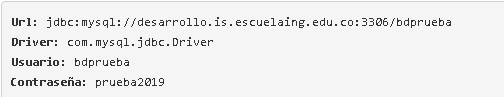

# LAB-07:

# CVDSLAB-07:

## Integrantes
* Miguel Rodríguez
* Daniel Ducuara

## Sección I

Empezamos clonando el proyecto  [MyBatis_Introduction_VideoRental](https://github.com/PDSW-ECI/MyBatis_Introduction_VideoRental)
posteriormente descargamos el archivo [ JDBCExample.java](http://campusvirtual.escuelaing.edu.co/moodle/pluginfile.php/191340/mod_assign/intro/JDBCExample.java)
y lo agregamos al paquete "edu.eci.cvds.sampleprj.jdbc.example".

En la clase  JDBCExample debemos cambiar los parámetros de conexión a la base de datos.
 
Por último debemos realizar las operaciones nombresProductosPedido, valorTotalPedido, registrarNuevoProducto y se verifica que la información 
coincida con la almacenada en la base de datos.

## Sección II
### Parte I
Se agregan los typeAliases en mybatis-config.xml, luego se debe configurar los mappers con el código aportado en el repositorio y configurarlos
con sus respectivos atributos, debemos agregar cuatro resultMap en total, para la clase cliente, ItemRentado, Item, TipoItem y en MyBatisExample
se consulta al cliente. 
### Parte II
Debemos configurar el XML en la operación consultarCliente(int id) en el mapper Cliente, y se debe verificar que funcione MyBatisExample, posteriormentese 
se hace lo mismo con la operación agregarItemRentadoACliente. Por último configuramos en ItemMapper las operaciones consultarItem y consultarItems.

## Circle Ci

## Codacy

